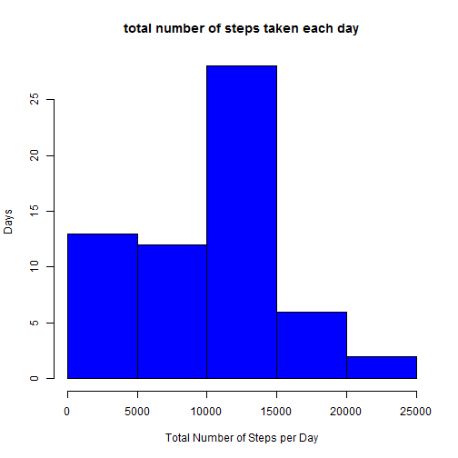
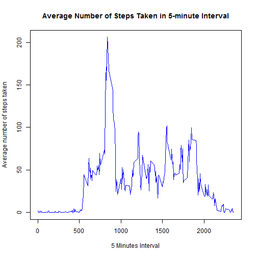
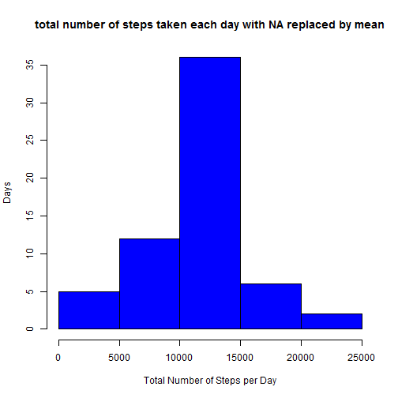
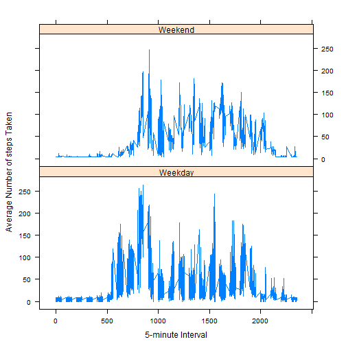

## Loading and preprocessing the data

```r
activity <- read.csv("activity.csv", colClasses = c("numeric","Date","numeric"))
```


## What is mean total number of steps taken per day?

```r
TotalStepsPerDay <- aggregate(activity$steps, list(activity$date), FUN=sum, na.rm=TRUE)
hist(TotalStepsPerDay$x, 
     col="blue", 
     xlab="Total Number of Steps per Day", 
     ylab="Days", 
     main="total number of steps taken each day")
```

 

```r
mean <- mean(TotalStepsPerDay$x, na.rm=TRUE)
mean
```

```
## [1] 9354.23
```

```r
median <- median(TotalStepsPerDay$x, na.rm=TRUE)
median
```

```
## [1] 10395
```


## What is the average daily activity pattern?

```r
average <- aggregate(activity$steps, list(activity$interval), FUN=mean, na.rm=TRUE)
plot(average$Group.1, 
     average$x, 
     type="l", 
     col="blue", 
     xlab="5 Minutes Interval", 
     ylab="Average number of steps taken", 
     main="Average Number of Steps Taken in 5-minute Interval")
```

 

```r
MaximumSteps <- max(average$x)
IntervalMaximumSteps <- average$Group.1[average$x == MaximumSteps]
IntervalMaximumSteps
```

```
## [1] 835
```


## Imputing missing values

```r
TotalNA <- sum(is.na(activity$steps))
TotalNA
```

```
## [1] 2304
```

```r
na <- which(is.na(activity$steps))
replace <- rep(mean(activity$steps, na.rm=TRUE), times=length(na))
activity[na, "steps"] <- replace

NewTotalStepsPerDay <- aggregate(activity$steps, list(activity$date), FUN=sum)
hist(NewTotalStepsPerDay$x, 
     col="blue", 
     xlab="Total Number of Steps per Day", 
     ylab="Days", 
     main="total number of steps taken each day with NA replaced by mean")
```

 

```r
newmean <- mean(NewTotalStepsPerDay$x)
newmean
```

```
## [1] 10766.19
```

```r
newmedian <- median(NewTotalStepsPerDay$x)
newmedian
```

```
## [1] 10766.19
```


## Are there differences in activity patterns between weekdays and weekends?

```r
activity$weekday <- weekdays(activity$date)
activity$daytype <- ifelse(activity$weekday=="Saturday" | activity$weekday=="Sunday","Weekend","Weekday")
library(lattice)
averagesteps <- aggregate(activity$steps, 
                       by=list(activity$daytype, 
                               activity$weekday, activity$interval), mean)
names(averagesteps) <- c("daytype", "weekday", "interval", "mean")
xyplot(mean ~ interval | daytype, averagesteps, 
       type="l", 
       lwd=1, 
       xlab="5-minute Interval", 
       ylab="Average Number of steps Taken", 
       layout=c(1,2))
```

 
